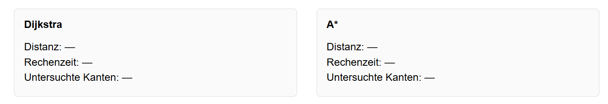

# Benutzerhandbuch
## Routenberechnung mit dem Dijkstra und A* Algorithmus

---

## Inhaltsverzeichnis

- [Abbildungsverzeichnis](#abbildungsverzeichnis)
- [1 Einleitung](#1-einleitung)
    - [1.1 Kurzbeschreibung des Produkts](#1-1-kurzbeschreibung-des-produkts)
- [2 Installationsanleitung](#2-installationsanleitung)
    - [2.1 Systemvoraussetzungen](#2-1-systemvoraussetzungen)
    - [2.2 Ausführung](#2-2-ausführung)
- [3 Benutzeroberfläche](#3-benutzeroberflaeche)
- [4 Fehlermeldungen](#4-fehlermeldungen)
- [5 Quellenangaben](#5-quellenangaben)

## Abbildungsverzeichnis

1. [Screenshot Header](#image-screenshot-header)
2. [Screenshot Start & Ziel](#image-screenshot-start-und-ziel)
3. [Screenshot Algorithmen](#image-screenshot-algorithmen)
4. [Screenshot Visualisierung](#image-screenshot-visualisierung)
5. [Screenshot Routeninformationen](#image-screenshot-routeninformationen)

## 1 Einleitung

In diesem Benutzerhandbuch wird die Nutzung der Routenberechnung mit dem Dijkstra und A* Algorithmus erklärt. Mit diesem Tool kann die kürzeste Route zwischen einem Start- und einem Zielpunkt berechnet werden, indem entweder der Dijkstra-Algorithmus, der A* Algorithmus oder beide Algorithmen zum Vergleich ausgewählt werden.

Es werden die Systemvoraussetzungen, die Ausführung der Anwendung, die verschiedenen Menüelemente und mögliche Fehlermeldungen erläutert. Ziel dieses Handbuchs ist es, eine einfache und verständliche Anleitung zur Nutzung der Routenberechnung zu bieten.

### 1.1 Kurzbeschreibung des Produkts

Diese Anwendung ist eine webbasierte Software zur Routenberechnung und Visualisierung von kürzesten Wegen in einem vorausgewählten Graphen. Sie dient dazu den Dijkstra und A* Algorithmus anzuwenden und deren Ergebnisse miteinander zu vergleichen. Sie richtet sich an alle, die die Grundlagen der Pfadfindung verstehen, demonstrieren oder testen möchten.

## 2 Installationsanleitung

### 2.1 Systemvoraussetzungen

Um die Routenberechnung mit dem Dijkstra und A* Algorithmus nutzen zu können, müssen folgende Systemvoraussetzungen erfüllt sein:
- **Node.js**: Die Anwendung benötigt Node.js, um die benötigten Pakete zu installieren und die Anwendung auszuführen. Node.js kann von der offiziellen Webseite [Node.js offizielle Webseite](https://nodejs.org/) heruntergeladen und installiert werden.
- **Internetverbindung**: Eine Internetverbindung ist erforderlich, um die benötigten Pakete zu installieren.

### 2.2 Ausführung

Damit das Programm ausgeführt werden kann, müssen zunächste alle benötigten Pakete installiert werden. Dies kann mit dem folgenden Befehl im Terminal gemacht werden:

```bash
npm install
```

Nachdem alle Pakete installiert wurden, kann die Anwendung mit dem folgenden Befehl gestartet werden:

```bash
npm start
```

## 3 Benutzeroberfläche

Im oben Bereich der Anwendung befindet sich der Header. In diesem steht zum einem der Name der Anwendung 
"Routenberechnung - Dijkstra & A*" und zum anderen befinden sich dort Links zu wichtigen Dokumentationen des Projekts, wie z.B. die Entwicklerdokumentation, der Testkatalog und dieses Benutzerhandbuch. (siehe [Screenshot Header](#image-screenshot-header))

**Header**:
- **Entwicklerdokumentation**: Ein Link zur Dokumentation des Projekts, erstellt mit JSdoc
- **Benutzerhandbuch**: Ein Link zu diesem Benutzerhandbuch, damit Nutzer schnell darauf zugreifen können  
- **Testkatalog**: Ein Link zum Testkatalog


**Start & Ziel**
- **Startpunkt**: Der Startpunkt legt fest, an welchem Punkt die Routenberechnung anfangen soll
- **Endpunkt**: Der Endpunkt legt das Ziel für die Routenberechnung fest.


**Algorithmus**
- **Dijkstra-Algorithmus**: Dieses Feld sagt der Routenberechnung dass der Dijkstra-algorithmus zur Berechnung genutzt werden soll
- **A* Algorithmus**: Dieses Feld sagt der Routenberechnung dass der A* Algorithmus zur Berechnung genutzt werden soll
- **Beide (Vergleich)**: Dieses Feld sagt der Routenberechnung es soll beide Algorithmen zur Berechnung nutzen und diese miteinander vergleichen


**Visualisierung**
- **Zwischenschritte anzeigen**: Aktiviert die Visualisierung der Zwischenschritte während der Routenberechnung
- **Zeit zwischen Schritten**: Legt die Zeit in Millisekunden fest, die zwischen der Visualisierung der Zwischenschritte liegen soll

**Berechnung starten**: Startet die Routenberechnung mit den ausgewählten Einstellungen


**Routeninformationen**
- **Distanz**: Zeigt die Länge der berechneten Route an
- **Berechnungszeit**: Zeigt die Zeit an, die für die Berechnung der Route benötigt wurde
- **Untersuchte Knoten**: Zeigt die Anzahl der Knoten an, die während der Berechnung besucht wurden



--- 

## 4 Fehlermeldungen

In diesem Abschnitt werden alle möglichen Fehlermeldungen erklärt, die während der Nutzung der Routenberechnung auftreten können:

- **Ausgewählte Start- oder Zielpunkt-ID ist ungültig.**: Diese Fehlermeldung erscheint, wenn die ausgewählten Start- oder Zielpunkt-IDs nicht gültig sind, z.B. wenn sie außerhalb des Bereichs der verfügbaren Punkte liegen.
- **Bitte wählen Sie mindestens einen Algorithmus aus.**: Diese Fehlermeldung erscheint, wenn der Benutzer versucht, die Routenberechnung zu starten, ohne einen Algorithmus auszuwählen.
- **Start- und Zielpunkt müssen unterschiedlich sein.**: Diese Fehlermeldung erscheint, wenn der Benutzer versucht, die Routenberechnung zu starten, aber der ausgewählte Startpunkt und Zielpunkt identisch sind.

--- 

## 5 Quellenangaben

- **Dijkstra-Algorithmus**: [Wikipedia - Dijkstra-Algorithmus](https://de.wikipedia.org/wiki/Dijkstra-Algorithmus)
- **A* Algorithmus**: [Wikipedia - A* Algorithmus](https://de.wikipedia.org/wiki/A*-Algorithmus)
- **Node.js**: [Node.js offizielle Webseite](https://nodejs.org/) Zur umwandlung von Markdown in HTML und zur Erstellung der Entwicklerdokumentation
- **JSdoc**: [JSdoc offizielle Webseite](https://jsdoc.app/) Zur erstellung der Entwicklerdokumentation
- **Cypress**: [Cypress offizielle Webseite](https://www.cypress.io/) Zur Erstellung von End-to-End Tests (Testing der grafischen Benutzeroberfläche)
- **Showdown**: [Showdown offizielle Webseite](https://github.com/showdownjs/showdown) Zur Umwandlung von Markdown in HTML
- **Showdown Markdown Syntax**: [Showdown Markdown Syntax](https://github.com/showdownjs/showdown/wiki/Showdown's-Markdown-syntax) Die Markdown Syntax, die von Showdown unterstützt wird
